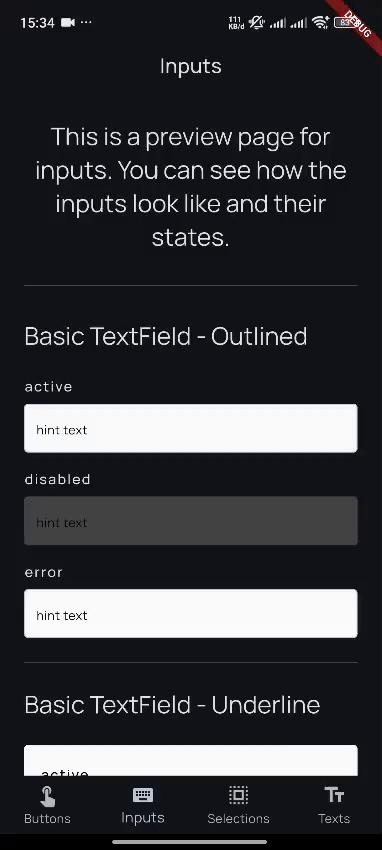
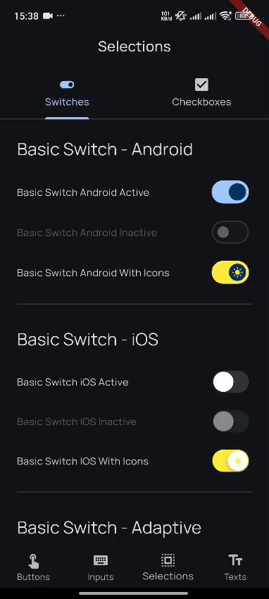
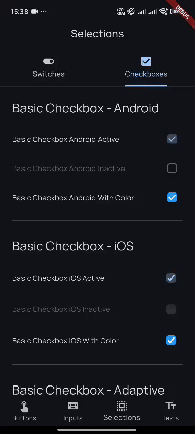

# 🚀 Flutter CleanBLoX Template (Monolithic)

A **production-ready Flutter starter kit** using **Clean Architecture** and **BLoC pattern**.
This template is designed for **monolithic applications**, making it easy to scale and maintain small Flutter projects.

Created with ❤️ by [**Pahnal Aditia**](https://www.linkedin.com/in/pahnaladitia)

---

## 📚 Table of Contents

- [🚀 Flutter CleanBLoX Template (Monolithic)](#-flutter-cleanblox-template-monolithic)
  - [📚 Table of Contents](#-table-of-contents)
  - [✨ Features](#-features)
  - [📁 Project Structure](#-project-structure)
      - [Project Setup Details](#project-setup-details)
    - [▶️ Running the App](#️-running-the-app)
    - [📦 Building APK \& IPA](#-building-apk--ipa)
      - [📱 Android APK](#-android-apk)
      - [🍏 iOS IPA](#-ios-ipa)
  - [Overview Widgets](#overview-widgets)
  - [📝 Developer Notes](#-developer-notes)
  - [🚀 Ready to Launch?](#-ready-to-launch)
  - [FYI](#fyi)

---

## ✨ Features

- **Clean Architecture**: Separate layers for data, domain, and presentation.
- **BLoC Pattern**: Reactive programming with BLoC for state management.
- **Flavors**: Support for multiple environments (staging, production).
- **Dependency Injection**: Using [GetIt](https://pub.dev/packages/get_it) for service locator.
- **Networking**: [Dio](https://pub.dev/packages/dio) for HTTP requests with interceptors.
- **Error Handling**: Global error handling with [Sentry](https://docs.sentry.io/platforms/flutter/).
- **Localization**: Built-in support for multiple languages using [intl](https://pub.dev/packages/intl).
- **Routing**: [go_router](https://pub.dev/packages/go_router) for declarative routing.
- **Testing**: Unit and widget tests with [flutter_test](https://api.flutter.dev/flutter/flutter_test/flutter_test-library.html).
- **CI/CD**: GitHub Actions for automated builds and tests.
- **App Links**: Universal links for Android and iOS.

---

## 📁 Project Structure

```bash
flutter_clean_blox_template_monolithic/
├── android/
├── ios/
├── lib/
│   ├── main_production.dart
│   ├── main_staging.dart
│   ├── app/                   # Main application entry point
│   ├── shared/                # Shared widgets and utilities
│   ├── core/                  # Core utilities and services
│   ├── features/              # Feature modules (e.g., auth, home)
├── test/                     # Unit and widget tests
├── pubspec.yaml              # Project dependencies and metadata
└── README.md                 # Project documentation
```

```bash
# Clone the repo
git clone https://github.com/fahnaladitia/flutter_clean_blox_template_monolithic.git

# Install dependencies for all packages
flutter pub get
```

#### Project Setup Details

- Package Name & Flavor Setup:
See [SETUP.md](docs/SETUP.md) for customizing your app’s name and flavors.

- App Links & Deep Linking:
See [APPLINKS.md](docs/APPLINKS.md) for universal link configuration for Android & iOS.

- CI/CD Configuration and Automated Builds:
See [ANDROID_CI.md](docs/ANDROID_CI.md) for setting up GitHub Actions for automated builds.

### ▶️ Running the App

```bash
# Staging environment
flutter run --flavor staging -t lib/main_staging.dart

# Production environment
flutter run --flavor production -t lib/main_production.dart
```

### 📦 Building APK & IPA

#### 📱 Android APK

```bash
# Build staging APK
flutter build apk --obfuscate --split-debug-info=out/android --flavor staging -t lib/main_staging.dart

# Build production APK
flutter build apk --obfuscate --split-debug-info=out/android --flavor production -t lib/main_production.dart
```

#### 🍏 iOS IPA

```bash
# Staging build
flutter build ios --flavor staging -t lib/main_staging.dart
flutter build ipa --obfuscate --split-debug-info=out/android --flavor staging -t lib/main_staging.dart

# Production build
flutter build ios --flavor production -t lib/main_production.dart
flutter build ipa --obfuscate --split-debug-info=out/android --flavor production -t lib/main_production.dart
```

---


## Overview Widgets

<p float="left">
  
  
  
  
</p>

---

## 📝 Developer Notes

- **Dependency Injection**: [GetIt](https://pub.dev/packages/get_it)  
- **Networking**: [Dio](https://pub.dev/packages/dio)  
- **Error Logging**: [Sentry](https://docs.sentry.io/platforms/flutter/)  
- **Localization**: [intl](https://pub.dev/packages/intl)  
- **Routing**: [go_router](https://pub.dev/packages/go_router)  
- **Testing & Logging**: [Chucker Flutter](https://pub.dev/packages/chucker_flutter), [Cote Network Logger](https://pub.dev/packages/cote_network_logger)  
- **UI Tooling**: [Flutter Launcher Icons](https://pub.dev/packages/flutter_launcher_icons), [Flutter Native Splash](https://pub.dev/packages/flutter_native_splash)  
- **Flavor Management**: [Flutter Flavors](https://docs.flutter.dev/deployment/flavors)  
- **CI/CD**: GitHub Actions integrated  
- **App Link Setup**: [App & Universal Links](https://docs.flutter.dev/cookbook/navigation/set-up-app-links)

---

## 🚀 Ready to Launch?

Fork this template, plug in your logic, and ship your next big thing! 🎯

## FYI
This template is designed for **monolithic applications** with single packages and feature-based, making it easy to scale and maintain small Flutter projects.
If you are looking for a **modular architecture** with multiple packages, check out the [Flutter CleanBLoX Template (Modular)](https://github.com/fahnaladitia/flutter_clean_blox_template_modular).